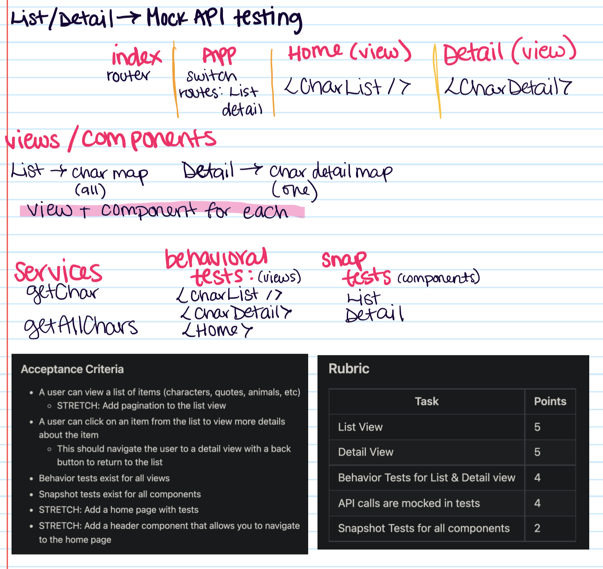

## Criteria

- A user can view a list of items (characters, quotes, animals, etc)
  - STRETCH: Add pagination to the list view
- A user can click on an item from the list to view more details about the item
  This should navigate the user to a detail view with a back button to return to the list
- Behavior tests exist for all views
- Snapshot tests exist for all components
  - STRETCH: Add a home page with tests
  - STRETCH: Add a header component that allows you to navigate to the home page

## Objectives

- Use react-testing-library to test components
- Use snapshot testing for presentational components
- Use mock service worker (MSW) to mock out an API in a test
- Use css modules to manage component-level styling

## Description

This is truly a build from scratch deliverable. You will need to pick an API to get a list of things and display them on a page.
\
\

